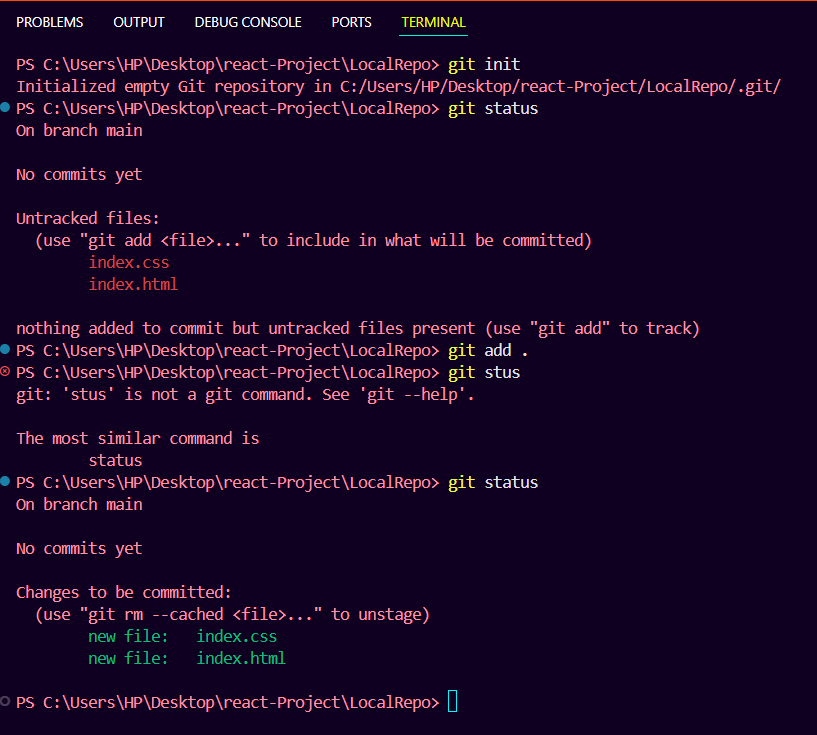
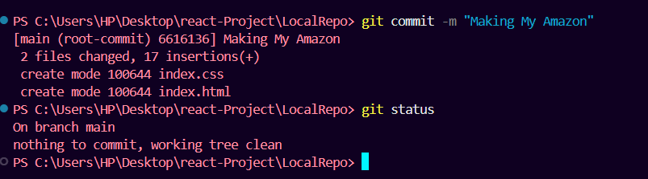
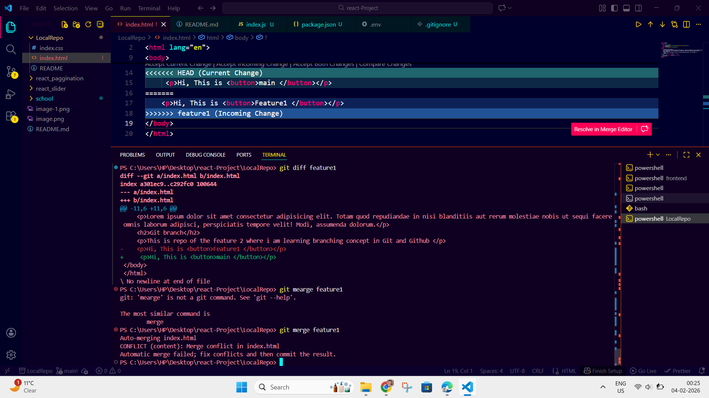

# Git And GitHub

## Git Status

- 
- 

echo "# DATA_BASE" >> README.md
git init
git add README.md
git commit -m "first commit"
git branch -M main
git remote add origin https://github.com/rahulkumar40/DATA_BASE.git
git push -u origin main
all about

Perfect 🔥
Ye classic GitHub README + first push flow hai.
Chalo line-by-line samjhte hain — kya hota hai, kyun hota hai, kab use hota hai.

1️⃣ echo "# DATA_BASE" >> README.md
Kya karta hai?

README.md file banata hai (agar nahi hai)

Usme ye line add karta hai:

# DATA_BASE

> > ka meaning

> > = append (end me add)

> hota to file overwrite ho jaati

📌 Iska output GitHub pe big heading banega

2️⃣ git init
Kya karta hai?

Current folder ko Git repository banata hai

.git/ folder create karta hai (hidden)

👉 Ab Git commands kaam karengi

3️⃣ git add README.md
Kya karta hai?

README ko staging area me bhejta hai

Matlab: “is file ko next commit me include karo”

📌 Abhi commit nahi hua, sirf ready hua

4️⃣ git commit -m "first commit"
Kya karta hai?

Staged files ka snapshot save karta hai

"first commit" = message (history ke liye)

👉 Ab Git history start ho gayi 🎉

5️⃣ git branch -M main
Kya karta hai?

Current branch ka naam main set karta hai

-M = force rename (safe here)

📌 Old default master → new standard main

6️⃣ git remote add origin https://github.com/rahulkumar40/DATA_BASE.git
Kya karta hai?

GitHub repo ko local repo se connect karta hai

origin = remote ka short name

URL = GitHub repo link

📌 Ab local ↔ GitHub connection ban gaya

7️⃣ git push -u origin main
Kya karta hai?

Local main branch ko GitHub pe push karta hai

-u = upstream set karta hai

👉 Future me sirf:

git push

kaam karega

🧠 Full Flow Summary (One Shot)
echo → README likha
git init → Git repo bana
git add → file stage hui
git commit → snapshot save
git branch → main branch
git remote → GitHub connect
git push → GitHub upload

📌 After this, GitHub pe kya dikhega?

✔ Repo created
✔ README visible on homepage
✔ DATA_BASE title show hoga
✔ Branch = main

🎯 Interview-ready explanation

“I initialize a Git repository, create a README using Markdown, commit it, connect the repo to GitHub using origin, and push the main branch.”

# Remote Branches

## What is a remote in Git?

> A remote is a just a nickname for another repository mainly on GitHub or In simple language i can say folder location

- Example:
  origin → https://github.com/rahulkumar40/DATA_BASE.git

👉 origin is NOT magic
👉 It’s just a short name for a long URL

🔗 What does git remote REALLY do?
🧠 Big idea first

git remote manages connections (bookmarks) to other Git repositories
— usually GitHub, GitLab, Bitbucket, etc.

A remote is NOT code,
it is NOT a branch,
it is just a saved address (URL) of another repo.

📌 Why do we even need git remote?

Without a remote:

Git works only on your laptop

You can commit, but:

❌ can’t push

❌ can’t pull

❌ can’t collaborate

git remote answers this question:

“Where should my code go?”
“Where should updates come from?”

🔍 Let’s explain each command deeply
1️⃣ git remote
git remote

What it does:

Shows only remote names

Not URLs

Just nicknames

Example output:
origin

Meaning:

Your repo is connected to one remote

Its short name is origin

📌 Why short name?
Typing:

git push https://github.com/rahulkumar40/DATA_BASE.git main

every time would be painful 😵
So Git lets you say:

git push origin main

2️⃣ git remote -v
git remote -v

What it does:

Shows:

remote name

exact URL

purpose (fetch / push)

Example:
origin https://github.com/rahulkumar40/DATA_BASE.git (fetch)
origin https://github.com/rahulkumar40/DATA_BASE.git (push)

Meaning:

fetch → where Git downloads updates from

push → where Git uploads your commits

📌 Usually both URLs are same
📌 But in advanced setups, they can be different

3️⃣ git remote add origin <url>
git remote add origin https://github.com/rahulkumar40/DATA_BASE.git

What it does:

Creates a new connection

Saves:

name: origin

address: GitHub repo URL

👉 After this, Git remembers:

“origin means this GitHub repo”

📌 This command does:

❌ NOT push code

❌ NOT create branches

❌ NOT upload anything

It only stores the address

4️⃣ git remote remove origin
git remote remove origin

What it does:

Deletes the saved bookmark

Breaks local ↔ GitHub connection

What it does NOT do:

❌ Does NOT delete GitHub repo

❌ Does NOT delete commits

❌ Does NOT delete branches

📌 It’s like deleting a contact from your phone
The person still exists 😄

🧠 Visual Memory Trick
Local Repo ──(origin)──▶ GitHub Repo

git remote = manages that arrow 🔗

⚠️ Very common beginner confusion
❌ “git remote creates GitHub repo”

NO ❌
You create GitHub repo on website
git remote just connects to it

🎯 Interview-ready explanation (perfect length)

“The git remote command manages named connections to external repositories. These remotes act as bookmarks that allow Git to fetch from or push commits to repositories like GitHub.”

# Github Branch

> Creating brach for the collaboration with team and other developer

# merge conflict

